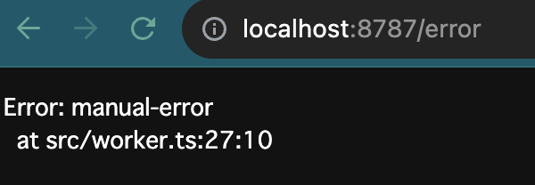

# error-recovery-worker

Demo of original error position recovery from runtime error.

https://error-recovery-server.mizchi.workers.dev/error

## Run

```bash
$ pnpm install

# setup sourcemap bucket once.
$ pnpm wrangler r2 bucket create scm-bucket
$ pnpm wrangler d1 create errors --experimental-backend
$ pnpm wrangler queues create error-queues

## Your wrangler.toml
# [[r2_buckets]]
# binding = "SCM_BUCKET"
# bucket_name = "scm-bucket"
# preview_bucket_name = "scm-bucket"

# [[queues.producers]]
#   queue = "error-queues"
#   binding = "ERROR_QUEUES"

# [[queues.consumers]]
#   queue = "error-queues"

# [[d1_databases]]
# binding = "DB" # i.e. available in your
# database_name = "errors"
# database_id = "<your-db-id>"
# migrations_dir = ".wrangler/migrations"

$ pnpm prisma generate
$ pnpm prisma migrade dev --create-only

# build and upload sourcemap
$ ./build.sh

# run with remote r2
$ pnpm wrangler dev --no-bundle --remote dist/worker.js
# open http://localhost:8787/error

# deploy
$ pnpm wrangler deploy --no-bundle --no-minify dist/worker.js
```

`/error` shows original error position.



## How it works

- Patch to run
- Upload sourcemap to R2
- Download sourcemap from R2 and get original position on error.
- Persist: Error => Queue => D1

At first, I will explain internal build.sh

```sh
# workers can not exec new Function(...)
# Stop internal source-map-js sorting because it's not important as far as I read it.
gsed -i "s/exports.quickSort = function/exports.quickSort = ()=>{};function nop/" node_modules/source-map-js/lib/quick-sort.js && echo 'patch node_modules/source-map-js/lib/quick-sort.js'

## Build only with --dry-run
pnpm wrangler deploy --dry-run --minify --outdir dist src/worker.ts

# open witch

## upload dist/worker.js.map
wrangler r2 object put scm-bucket/worker.js.map --file=dist/worker.js.map
```

Load sourcemap consumer from runtime.

```ts
let _smc: SourceMapConsumer = null as any;
async function loadSMC(bucket: R2Bucket) {
	if (_smc) return _smc;
	const mapFileBody = await bucket.get('worker.js.map');
	const map = await mapFileBody?.json();
	const consumer = new SourceMapConsumer(map as RawSourceMap);
	_smc = consumer;
	return consumer
}

// ...

// restore original error position from runtime error
if (err instanceof Error && err.message === 'manual-error') {
	const smc = await loadSMC(env.SCM_BUCKET);
	const frames = ErrorStackParser.parse(err);
	const originalFrames = frames.map(frame => {
		return smc.originalPositionFor({
			line: frame.lineNumber!,
			column: frame.columnNumber!,
		});
	});
}
```

## TODO

- [ ] use local r2
- [ ] upload with hash
- [ ] client sourcemap recovery
- [ ] omit patch with another way
